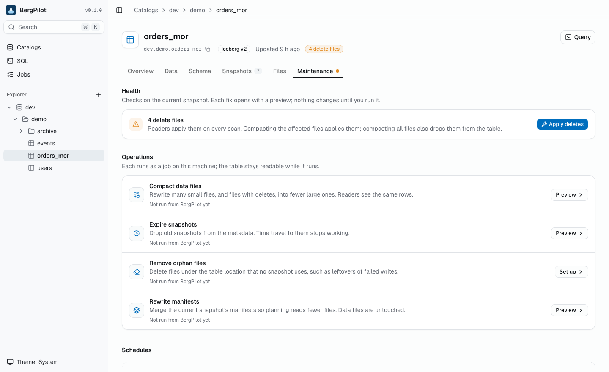
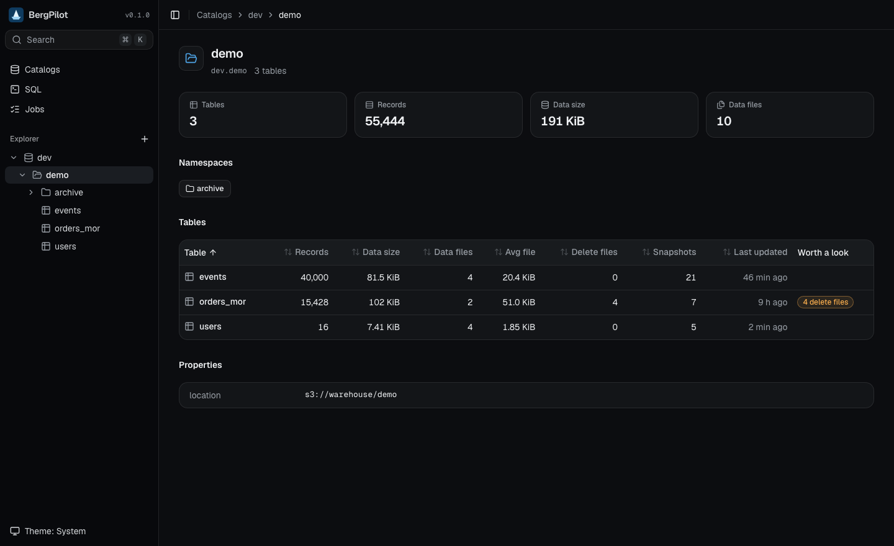
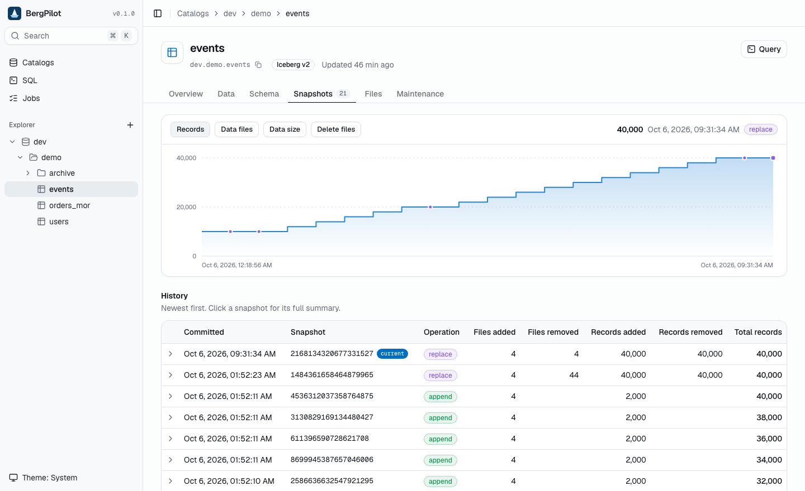
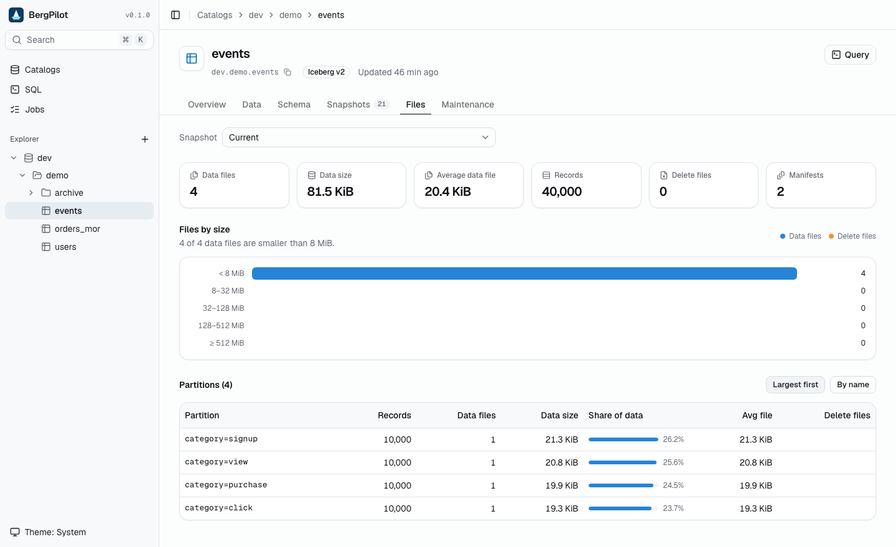
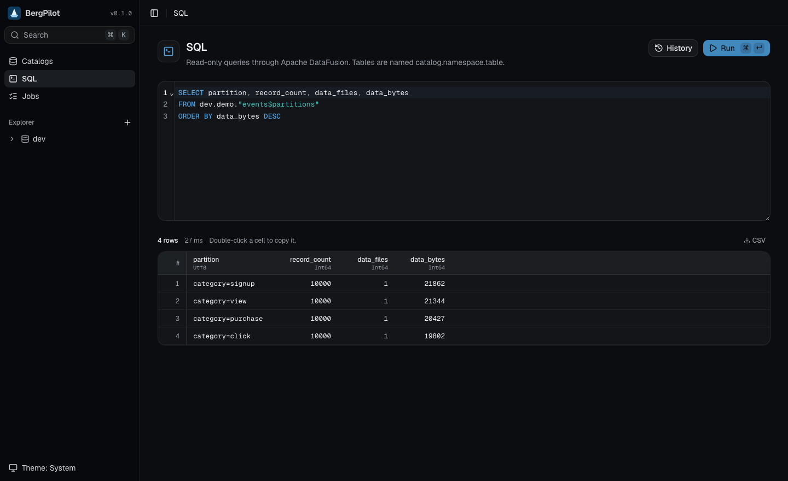

# BergPilot

Observability and maintenance for Apache Iceberg™ tables, in a single Rust service. No JVM, no Spark.



> **Status:** early, but usable. Try it against a test catalog first: maintenance operations change tables.

## What it does

- **Browse** catalogs, nested namespaces and tables, or jump to any table with ⌘K. Namespace pages summarize every table and point
  out the ones worth a look (many small files, delete files, long snapshot histories).
- **Inspect a table:** schema, partitioning and properties; snapshot history with a trend chart of
  records, files and size; files by size for any snapshot; a per-partition breakdown; the first rows.
- **Query** with SQL (Apache DataFusion), read-only. Metadata tables such as
  `catalog.ns."table$files"` and `"table$partitions"` work too, and `"table@<snapshot or branch>"`
  reads a table as it was. Results export to CSV.
- **Maintain:** compact data files, expire snapshots (optionally deleting their files), remove
  orphan files and rewrite manifests. Each has a preview that changes nothing, runs as a background
  job, and can be scheduled with cron.

| | |
| --- | --- |
|  |  |
|  |  |

## Catalogs

| Type | Connects with | Notes |
| --- | --- | --- |
| REST | URI, optional OAuth2 client credentials or bearer token | Vended credentials are refreshed automatically. |
| AWS Glue | Warehouse, region, default credential chain, profile or access keys | Glue databases are namespaces; Glue has no nesting. |
| S3 Tables | Table bucket ARN, region, AWS credentials | Not yet tested against AWS; local mocks cover listing only. |
| JDBC | PostgreSQL, MySQL or SQLite URL; password kept separately | Reads catalogs created by Java's `JdbcCatalog` (Spark, Flink, Trino). Set "catalog name in the database" to the name they used. |

## Running

Prebuilt binaries for Linux (x86_64, aarch64) and macOS (Apple silicon) are attached to
[releases](https://github.com/chenzl25/bergpilot/releases). To build from source, build the web UI
first; the release binary embeds it:

```bash
pnpm --dir web install
pnpm --dir web build
cargo build --release
./target/release/bergpilot
```

Open http://127.0.0.1:7878 and add a catalog. BergPilot keeps its database and secret key in
`~/.bergpilot` (`--data-dir` to change).

In SQL, tables are named `catalog.namespace.table`. Write a nested namespace as one quoted
identifier: `prod."sales.eu".orders`, a metadata table as `prod.sales."orders$snapshots"`, and an
older version as `prod.sales."orders@<snapshot id>"` or `"orders@<branch or tag>"`.

## Safety

- BergPilot listens on 127.0.0.1 and answers only requests addressed to `localhost` (against DNS
  rebinding). To listen on another address, set an access token with `BERGPILOT_TOKEN` and pass
  `--bind 0.0.0.0:7878`; the UI asks for the token.
- Catalog secrets are encrypted at rest with a key in the data directory and never sent to the
  browser.
- SQL is read-only. Maintenance needs an explicit click and confirmation, or a schedule you create.
- Orphan-file removal compares normalized paths, never deletes files younger than a day, and
  refuses to run if it cannot find the table's own current files in the storage listing.
- Maintenance runs on the machine BergPilot runs on, reading and writing data through it. Run it
  close to the data for large tables.

## Built on

- [risingwavelabs/iceberg-rust](https://github.com/risingwavelabs/iceberg-rust): catalogs,
  metadata, scans, DataFusion integration and maintenance actions.
- [nimtable/iceberg-compaction](https://github.com/nimtable/iceberg-compaction): data-file compaction.
- [Apache DataFusion](https://datafusion.apache.org/), [axum](https://github.com/tokio-rs/axum),
  React, Vite, Tailwind CSS and [shadcn/ui](https://ui.shadcn.com).

The Iceberg crates are git dependencies pinned to a revision, so BergPilot is not published to
crates.io. BergPilot is inspired by [Nimtable](https://github.com/nimtable/nimtable).

## Development

The Rust toolchain is pinned in `rust-toolchain.toml`.

```bash
docker compose -f dev/docker-compose.yml up -d   # REST catalog on :8181, storage on :9000
cargo run --example seed                         # sample tables in namespace "demo"
cargo run                                        # API and UI on :7878
pnpm --dir web dev                               # UI with hot reload on :5173
```

For the local catalog use URI `http://localhost:8181`, S3 endpoint `http://localhost:9000`,
region `us-east-1`, access key `admin`, secret `password`, and path-style access.

To seed other catalog types (for example Glue in a [moto](https://github.com/getmoto/moto) server),
see the environment variables at the top of `crates/bergpilot/examples/seed.rs`.

`cargo test` runs unit tests and integration tests against a SQLite catalog with a local
warehouse, and regenerates the TypeScript API types in `web/src/api/generated`; commit them with
any change to `crates/bergpilot/src/types.rs`. Tagging `v*` builds the release binaries.

## License

[Apache License 2.0](LICENSE).

Apache®, Apache Iceberg™, Apache DataFusion™ and their logos are trademarks of the Apache Software
Foundation. BergPilot is not affiliated with or endorsed by the Apache Software Foundation.
